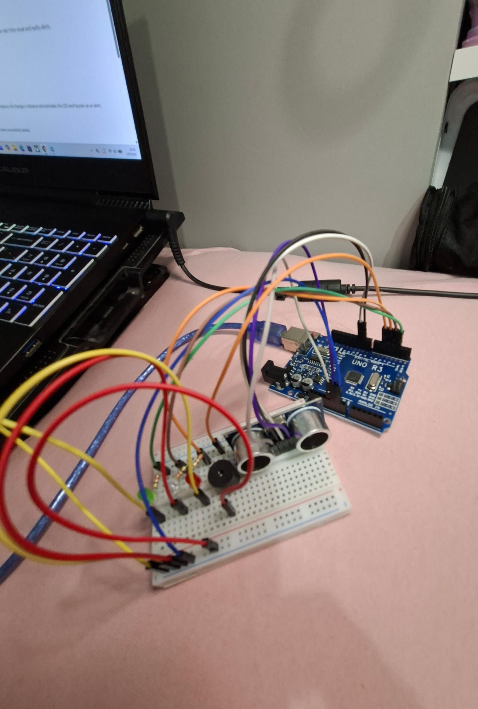

#🫀Biomedical Sensor Project#

  -An Arduino-based biomedical sensor project designed to detect proximity and provide real-time visual and audio alerts.
  
##Current Setup

Current Features;

- Proximity detection
- LED-based visual alert
- Buzzer-based audio alert
 -Arduino UNO micocontroller

How İt Works;

- When an object or hand approaches the sensor, the system detects the change in distance and activates the LED and buzzer as an alert.

Current Status;

- The proximity detection, LED alert, buzzer alert have been successfully tested.

Planned Improvements

- Add body temperature measurement🌡️ 
- Add heart-rate monitoring🩺
- Add an LCD/OLED display🖥️
 -Combine sensor readings into a single monitoring system🧩

Hardware

 Arduino UNO
 Breadboard
 Proximity sensor
 LEDs
 Buzzer
 
About This Project

 I am using this project to learn more about Arduino, sensors and how hardware and software work together. I will be documenting the diffrent stages here as I build and test new parts.

 
